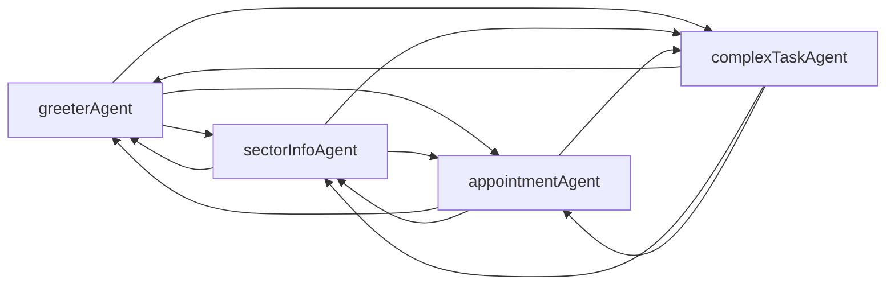

# Guide interne: Ajouter un nouvel agent (OpenAI Realtime Agents SDK)

Ce guide explique la différence entre scénarios, agents et outils, et comment ajouter un nouvel agent/scénario dans ce repo. Il s’appuie sur le guide officiel: https://openai.github.io/openai-agents-js/guides/voice-agents/build/

## Définitions

- **Scénario**
  - Un ensemble d’agents qui collaborent, avec des transferts définis entre eux.
  - Exemple: `realEstateScenario` dans `src/app/agentConfigs/real-estate-agent/index.ts`.

- **Agent (RealtimeAgent)**
  - Un agent vocal en temps réel, configuré avec des instructions (prompt), une voix, des **outils**, et des **handoffs** (transferts) vers d’autres agents.
  - Exemple: `greeterAgent`, `sectorInfoAgent`, `appointmentAgent`, `complexTaskAgent`.

- **Outil (tool)**
  - Une fonction exécutable côté serveur (Node/Next) que l’agent peut appeler pour effectuer des actions concrètes (ex. interroger des dispo, créer une tâche, envoyer un email).
  - Déclaré via `tool({ name, description, parameters, execute })`.

## Contraintes clés (référence guide officiel)

- **Handoffs**
  - Un handoff bascule la session vers un autre RealtimeAgent (même backend Realtime). On ne peut pas changer de voix/modèle dans le handoff.
  - Pour utiliser un autre modèle (ex. reasoning), déléguer via un outil (pattern « delegation through tools »).

- **Audio / VAD / Interruptions**
  - La gestion de l’audio, VAD et interruptions est déjà câblée dans `App.tsx` via `useRealtimeSession`.

- **Guardrails**
  - Les sorties sont modérées via `createModerationGuardrail(companyName)` dans `App.tsx`.

## Structure du repo (extraits pertinents)

- `src/app/agentConfigs/` contient les scénarios et agents
  - `index.ts` (registry de scénarios)
  - `real-estate-agent/` (exemple complet immobilier)
    - `greeter-agent.ts`
    - `sector-info-agent.ts`
    - `appointment-agent.ts`
    - `complex-task-agent.ts`
    - `constants.ts` (ex: `realEstateCompanyName`)
    - `index.ts` (assemble les agents et définit les handoffs)
- `src/app/App.tsx`
  - `sdkScenarioMap` (scénarios disponibles côté client)
  - Mapping `companyName` → guardrails

## Ajouter un nouveau scénario + agents (pas à pas)

1. **Créer un dossier** `src/app/agentConfigs/<votre-scenario>/`.
2. **Créer des agents** (1 fichier par agent) avec:
   - `name`, `voice`, `instructions`: prompt concis et orienté voix.
   - `tools`: liste d’outils pertinents (voir section Outillage).
   - `handoffDescription`: courte description (utile pour le transfert).
3. **Configurer les handoffs** dans `index.ts` du scénario:
   ```ts
   (agentA.handoffs as any).push(agentB, agentC);
   ```
4. **Exporter le scénario** (tableau d’agents) dans `index.ts`:
   ```ts
   export const myScenario = [agentA, agentB, agentC];
   ```
5. **Enregistrer le scénario dans le registre** `src/app/agentConfigs/index.ts`:
   ```ts
   export const allAgentSets = { ... , myScenario };
   ```
6. **Ajouter le scénario au client** dans `src/app/App.tsx`:
   - `sdkScenarioMap["myScenario"] = myScenario`
   - Si besoin de guardrails personnalisés: ajouter un `companyName` au mapping.
7. **Éviter les dépendances circulaires**:
   - Placez les constantes partagées (ex: nom d’entreprise) dans un `constants.ts` du scénario.
   - Importez ces constantes **directement** dans `App.tsx` (évitez de les ré-exporter via `index.ts`).
8. **Tester**: `npm run dev` puis sélectionner votre scénario dans le menu "Scenario".

## Exemple: Scénario Immobilier (`realEstate`)

### Agents

- **`greeterAgent`** (`greeter-agent.ts`)
  - Accueil + routage. Demande le besoin et transfère vers l’agent approprié.
  - Transferts possibles: `sectorInfoAgent`, `appointmentAgent`, `complexTaskAgent`.

- **`sectorInfoAgent`** (`sector-info-agent.ts`)
  - Répond aux questions quartiers/secteurs: prix moyen, commodités, transports, ambiance.
  - Outils: `getSectorInfo`, `compareSectors` (exemples inclus).

- **`appointmentAgent`** (`appointment-agent.ts`)
  - Collecte les infos (nom, téléphone, email, type de projet, préférences) puis propose des créneaux.
  - Outils: `checkAvailability` (déjà implémenté), `bookAppointment` (exemple inclus).

- **`complexTaskAgent`** (`complex-task-agent.ts`)
  - Gère les demandes hors périmètre. Crée une tâche interne et envoie un email récapitulatif.
  - Outils: `createTask`, `sendEmail`.

### Outils (extraits)

- Définition générique d’un outil:
  ```ts
  import { tool } from '@openai/agents/realtime';

  const myTool = tool({
    name: 'myToolName',
    description: 'Ce que fait l’outil',
    parameters: {
      type: 'object',
      properties: { /* schéma JSON */ },
      required: [/* champs obligatoires */],
      additionalProperties: false,
    },
    execute: async (input: any) => {
      // logique serveur
      return { /* résultat */ };
    },
  });
  ```

- Outil RDV: `checkAvailability` (dans `appointment-agent.ts`)
  - Entrée: préférences (matin/après-midi, jours)
  - Sortie: créneaux disponibles (mock)

- Outils ComplexTask: `createTask`, `sendEmail` (dans `complex-task-agent.ts`)
  - `createTask(summary, details?, priority)` → `taskId`, `status`
  - `sendEmail(to, subject, body)` → `sent`, `messageId`

### Handoffs

- Définis dans `real-estate-agent/index.ts`:
  ```ts
  (greeterAgent.handoffs as any).push(sectorInfoAgent, appointmentAgent, complexTaskAgent);
  (sectorInfoAgent.handoffs as any).push(greeterAgent, appointmentAgent, complexTaskAgent);
  (appointmentAgent.handoffs as any).push(greeterAgent, sectorInfoAgent, complexTaskAgent);
  (complexTaskAgent.handoffs as any).push(greeterAgent, sectorInfoAgent, appointmentAgent);
  export const realEstateScenario = [greeterAgent, sectorInfoAgent, appointmentAgent, complexTaskAgent];
  ```

### Constantes & Guardrails

- `real-estate-agent/constants.ts` expose `realEstateCompanyName`.
- Dans `App.tsx` importez:
  ```ts
  import { realEstateCompanyName } from '@/app/agentConfigs/real-estate-agent/constants';
  ```
- Ajoutez-le au mapping Guardrails:
  ```ts
  const companyNameMap = {
    customerServiceRetail: customerServiceRetailCompanyName,
    chatSupervisor: chatSupervisorCompanyName,
    realEstate: realEstateCompanyName,
  };
  ```

## Bonnes pratiques

- **Instructions courtes & vocales**: style concis, naturel, éviter les listes trop longues.
- **Outils cohérents**: schémas JSON clairs, `additionalProperties: false`.
- **1 responsabilité par agent**: facilite le routage et la maintenance.
- **Tester les transferts**: vérifier que l’agent par défaut est celui désiré et que les handoffs couvrent les cas attendus.
- **Éviter les cycles d’import**: importer les constantes directement depuis `constants.ts`.

## Dépannage (FAQ)

- **Hydration error (classe ajoutée par extension)**
  - Résolu en ajoutant `suppressHydrationWarning` sur `<html>` dans `src/app/layout.tsx`.

- **TDZ / Cannot access 'X' before initialization**
  - Évitez de ré-exporter des constantes via `index.ts` si ce `index.ts` importe déjà des agents qui eux importent ces constantes. Importez directement depuis `constants.ts`.

- **Le scénario n’apparaît pas dans l’UI**
  - Vérifier l’ajout dans `src/app/agentConfigs/index.ts` (registry) ET `sdkScenarioMap` dans `src/app/App.tsx`.

## Diagramme (exemple Immobilier)



## Checklist d’ajout rapide

- [ ] Dossier `src/app/agentConfigs/<scenario>/` créé
- [ ] Agents créés avec instructions/outils/voix
- [ ] Handoffs configurés dans `<scenario>/index.ts`
- [ ] Scénario exporté et ajouté dans `src/app/agentConfigs/index.ts`
- [ ] Ajouté dans `sdkScenarioMap` de `src/app/App.tsx`
- [ ] Guardrails: companyName mappé si nécessaire
- [ ] Tests UI: menu Scenario → connexion → transferts OK
